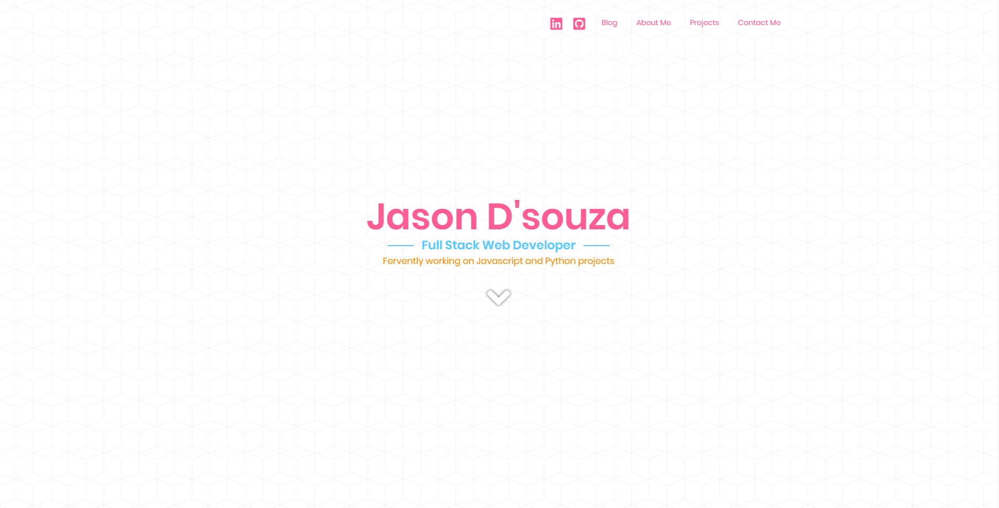

<h1>My Portfolio</h1>

<h4>My portfolio and also my submission to coding challenge 16 - for the Complete Web Developer course on udemy by Andrei Neagoie</h4>

It can be reached live here at <a href="jasondsouza.dev">jasondsouza.dev</a>

To run this in developer mode
<ul>
    <li><code>git clone</code> this repository</li>
    <li>run <code>npm install</code></li>
    <li>run <code>npm start</code></li>
    <li>Go to <code>http://localhost:3000</code> in your browser</li>
</ul>

